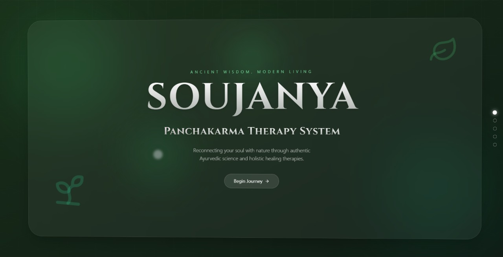
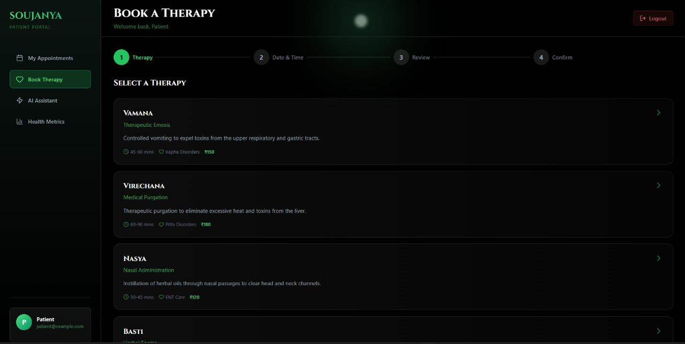
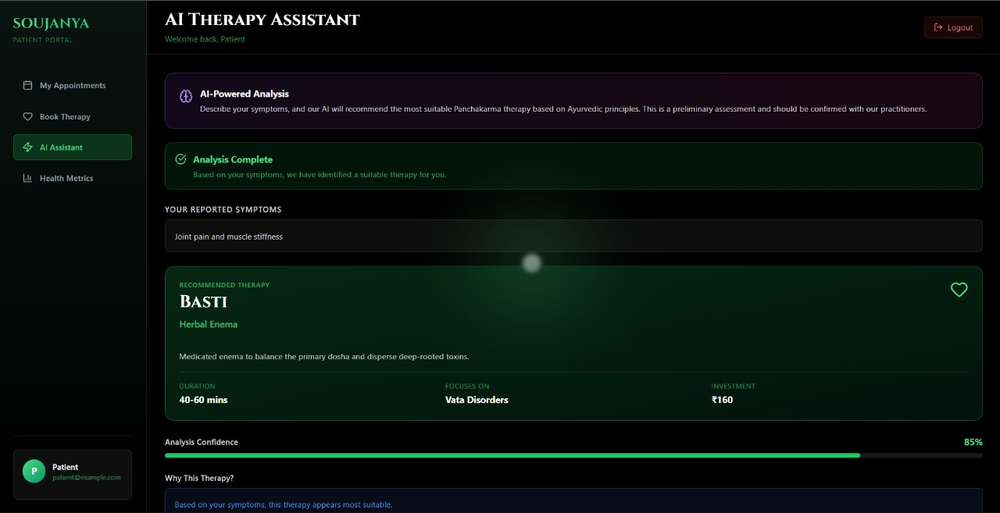
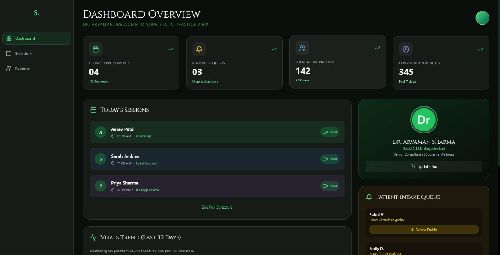

<div align="center">

  <a href="#">
    
  </a>
  <a href="#">
    
  </a>
  <a href="#">
    
  </a>

  <br />
  <br />

  

  <br />

  <h1 style="font-size: 3rem; margin-bottom: -10px;">SOUJANYA</h1>
  <a href="https://git.io/typing-svg"></a>

  <p align="center">
    <b>Lightweight. Immersive. Modern.</b><br />
    A minimalist solution orchestrating the Panchakarma therapy experience.
  </p>

</div>

---

## ⚡ The 24-Hour Vision (Hackathon Context)

> **"We didn't just want to build a form; we wanted to build an atmosphere."**

**Soujanya** was conceptualized and engineered during a rapid **18-hour sprint** for **Mumbai Hacks**. While this release is an MVP, the architecture is designed for scalability. We focused on "Progressive Disclosure", showing the user only what they need, when they need it.

| Timeline | Milestone | Status |
| :--- | :--- | :--- |
| **0-6 hrs** | UI/UX Design & Component Architecture | ✅ |
| **6-12 hrs** | React Logic, Routing & Auth Context | ✅ |
| **12-18 hrs** | AI Integration (Stubs) & Micro-interactions | ✅ |
| **Future** | Backend Integration & Payment Gateways | ⏳ |

---

## 🎨 Tech Stack

We leveraged a modern, performance-first stack to ensure 60fps animations and instant load times.

<div align="center">
  <a href="https://skillicons.dev">
    
  </a>
</div>

- **Frontend:** React + Vite
- **Styling:** Tailwind CSS + PostCSS
- **Animations:** Framer Motion
- **Icons:** Lucide-react
- **Architecture:** Component-based, Service-layer pattern

---

## 🔮 Key Features

### 🩺 For the Patient
- **Ambient Landing Experience:** Parallax effects, custom cursors, and dark-themed visuals to induce calmness.
- **AI Symptom Assistant:** A dedicated interface demonstrating how NLP can guide patients to the right therapy (Client + API stub).
- **Seamless Booking:** Date/Time selection with immediate availability checks.
- **Health Metrics:** Visualize therapy progress and vital stats.

### 🛠️ Technical Highlights
- **Service Layer Abstraction:** All API calls are centralized in `services/api.js` for easy swap-out.
- **Mock Auth Context:** A client-side demonstration of secure route protection.
- **Responsive Design:** Mobile-first approach ensuring the app feels native on phones.

---

## 📸 Demo & Screenshots

| Landing Page | Booking Flow |
| :---: | :---: |
|  |  |

| AI Assistant | Practitioner Dashboard |
| :---: | :---: |
|  |  |

---

## 🧩 Architecture & Data Flow

We used a modular architecture to separate UI from logic. Here is how the Booking Flow operates under the hood:

```mermaid
graph LR
    A[User Selects Therapy] --> B{Check Auth};
    B -- No --> C[Login Page];
    B -- Yes --> D[Booking Component];
    D --> E[Check Availability];
    E -- API Stub --> F[Mock Slots];
    F --> D;
    D --> G[Confirm Booking];
    G -- POST --> H[Update Dashboard];